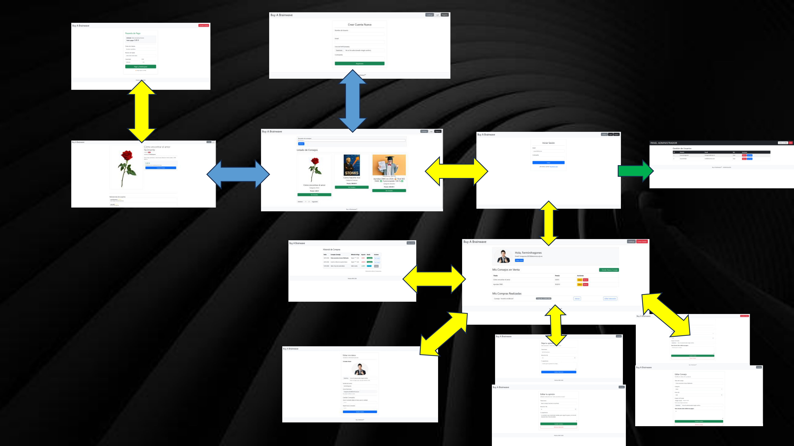
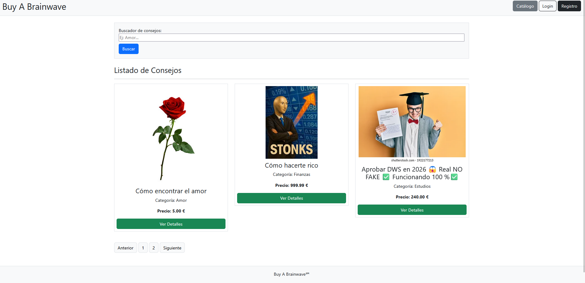
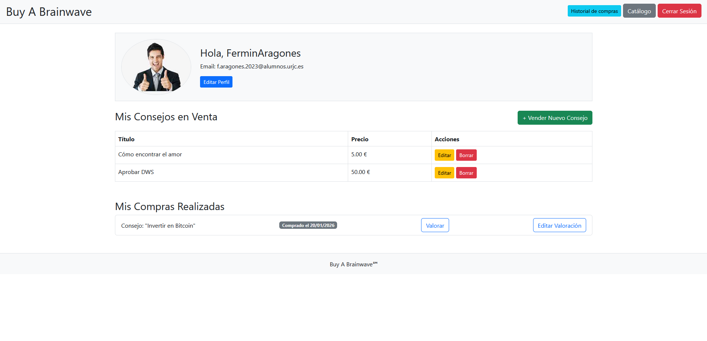
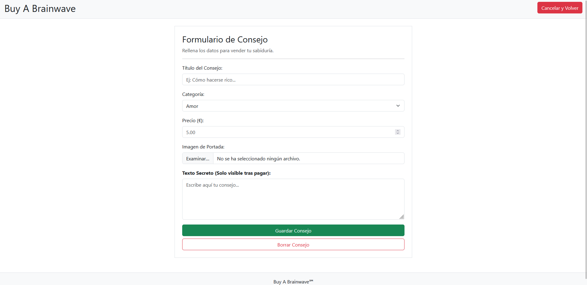
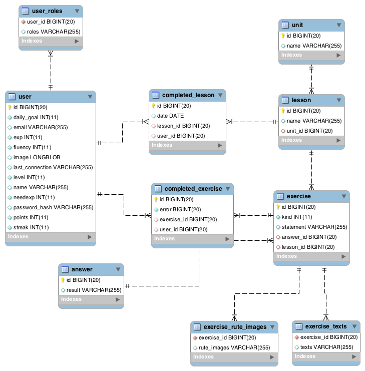
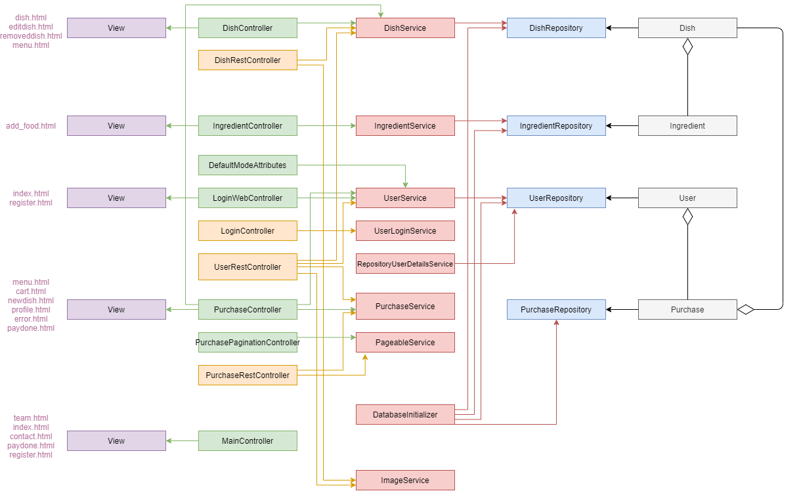

# Buy A Brainwave

## 👥 Miembros del Equipo
| Nombre y Apellidos | Correo URJC | Usuario GitHub |
|:--- |:--- |:--- |
| Fermin Aragones Gonzalez | f.aragones.2023@alumnos.urjc.es | FerminAragones |


---

## 🎭 **Preparación: Definición del Proyecto**

### **Descripción del Tema**
Buy A Brainwave es página web de compra/venta de consejos.  
Es como una web de compra/venta de objetos de segunda mano pero aquí se trafica con consejos en su lugar.  
Básicamente tú solo ves una imagen y el título del consejo y solo después de pagar puedes ver el consejo.  
E.g.: Título: "Cómo encontrar el amor fácilmente" Categoría: "Amor" Consejo: "El que come de todo no pasa hambre."  
A los usuarios les aporta conocimiento variado para que su vida sea un poco más fácil, así como la oportunidad de lucrarse vendiendo su propio conocimiento.

### **Entidades**
Indicar las entidades principales que gestionará la aplicación y las relaciones entre ellas:

1. **Usuario:** Nombre, contraseña, email, foto de perfil.
2. **Consejo:** Título (ej: "Cómo olvidar a tu ex"), Categoría ("Amor"), Precio, Texto Secreto (el consejo en sí que desbloqueas después de pagar), Imagen de portada.
3. **Transacción:** Entidad intermedia que conecta Usuario y Consejo. Registra quién compró qué y cuándo.
4. **Valoración:** Un usuario escribe una valoración sobre un consejo concreto.

**Relaciones entre entidades:**
- **Usuario - Consejo (1:N):** *Relación de Venta*. Un Usuario (vendedor) publica múltiples Consejos, pero un Consejo específico es creado por un solo Usuario.
- **Usuario - Consejo (N:M):** *Relación de Compra*. Un Usuario puede comprar muchos Consejos y un mismo Consejo puede ser comprado por muchos Usuarios. Esta relación N:M se gestiona a través de la entidad Transacción.
- **Usuario - Valoración (1:N):** Un Usuario puede escribir múltiples Valoraciones.
- **Consejo - Valoración (1:N):** Un Consejo puede recibir múltiples Valoraciones de distintos usuarios.

### **Permisos de los Usuarios**
Describir los permisos de cada tipo de usuario e indicar de qué entidades es dueño:

* **Usuario Anónimo**: 
  - **Permisos:** Visualización del catálogo de consejos (solo título, categoría, precio e imagen de portada, **nunca** el texto secreto), búsqueda/filtrado de consejos y acceso a las páginas de login/registro.
  - **No es dueño de ninguna entidad.**

* **Usuario Registrado**: 
  - **Permisos:** Todas las del anónimo más: comprar consejos (desbloquear contenido), vender sus propios consejos (crear/editar/borrar), subir imágenes, ver su historial de compras y valorar consejos adquiridos.
  - **Es dueño de:**
    - Su entidad **Usuario** (puede editar su propio perfil/avatar).
    - Los **Consejos** que ha publicado para la venta (puede editar el precio o borrarlos).
    - Sus **Transacciones** (puede consultar su propio historial de compras).
    - Sus **Valoraciones** (puede editar o borrar las reseñas que él mismo escribió).

* **Administrador**: 
  - **Permisos:** Control total de la plataforma. Puede borrar consejos inapropiados (ej. estafas o contenido ilegal), eliminar usuarios conflictivos y moderar valoraciones falsas.
  - **Es dueño de:** Tiene permisos globales sobre todas las entidades (**Usuario**, **Consejo**, **Transacción**, **Valoración**) para tareas de mantenimiento y moderación.

### **Imágenes**
Indicar qué entidades tendrán asociadas una o varias imágenes:

- **Entidad Usuario:** Una imagen de avatar (foto de perfil) que identifica al vendedor/comprador.
- **Entidad Consejo:** Una imagen de portada obligatoria. Es vital para la web, ya que el usuario "compra a ciegas" viendo solo esta imagen y el título antes de pagar.
---

## 🛠 **Práctica 1: Maquetación de páginas con HTML y CSS**

### **Vídeo de Demostración**
📹 **[Enlace al vídeo en YouTube](https://www.youtube.com/watch?v=x91MPoITQ3I)**
> Vídeo mostrando las principales funcionalidades de la aplicación web.

### **Diagrama de Navegación**
Diagrama que muestra cómo se navega entre las diferentes páginas de la aplicación:



> [Azul: Todos los users. Amarillo: user registrados. Verde: Administrador. Como se puede ver en el diagrama, desde el index se puede acceder a cualquier parte de la web, y otra pantalla importante a partir de la cual se pueden tocar varias entidades es la de profile-view]

### **Capturas de Pantalla y Descripción de Páginas**

#### **1. Página Principal / Home**


> [Desde aqui te puedes registrar o logear. Como user anónimo también puedes ver todo el catálogo de productos así como ver sus detalles.]



> [Esta página es esencial para la web, solo puedes acceder a ella tras registrarte o logearte. En ella puedes ver/crear/modificar tus consejos y tus valoraciones a los consejos de otros users, así como ver tus transacciones (botón "Historial de compras"). También puedes ver algunos datos como el correo o tu avatar actual e incluso cambiar cualquier credencial de tu cuenta a través del botón "Editar Perfil".]


> [Aunque no sea un pilar para el navegamiento de la web como las dos pantallas anteriores, esta página también guarda cierta relevancia debido a que en ella vemos cuáles son los campos que componen cada uno de nuestros consejos, que al final son la entidad en torno a la cual gira toda la página. Cabe destacar que cuanto el user vende un consejo, ese consejo no desaparece de la web, sino continua allí para que distintos users puedan comprarlo también, de ahí sale la relación N:M. Un user puede vender muchos consejos distintos al mismo tiempo que un consejo puede ser comprado por muchos users distintos.]


### **Participación de Miembros en la Práctica 1**

#### **Alumno 1 - [Fermín Aragonés González]**

Todas las tareas, código, etc realizadas por Fermín :)


---

## 🛠 **Práctica 2: Web con HTML generado en servidor**

### **Vídeo de Demostración**
📹 **[Enlace al vídeo en YouTube](https://www.youtube.com/watch?v=x91MPoITQ3I)**
> Vídeo mostrando las principales funcionalidades de la aplicación web.

### **Navegación y Capturas de Pantalla**

#### **Diagrama de Navegación**

Solo si ha cambiado.

#### **Capturas de Pantalla Actualizadas**

Solo si han cambiado.

### **Instrucciones de Ejecución**

#### **Requisitos Previos**
- **Java**: versión 21 o superior
- **Maven**: versión 3.8 o superior
- **MySQL**: versión 8.0 o superior
- **Git**: para clonar el repositorio

#### **Pasos para ejecutar la aplicación**

1. **Clonar el repositorio**
   ```bash
   git clone https://github.com/[usuario]/[nombre-repositorio].git
   cd [nombre-repositorio]
   ```

2. **AQUÍ INDICAR LO SIGUIENTES PASOS**

#### **Credenciales de prueba**
- **Usuario Admin**: usuario: `admin`, contraseña: `admin`
- **Usuario Registrado**: usuario: `user`, contraseña: `user`

### **Diagrama de Entidades de Base de Datos**

Diagrama mostrando las entidades, sus campos y relaciones:



> [Descripción opcional: Ej: "El diagrama muestra las 4 entidades principales: Usuario, Producto, Pedido y Categoría, con sus respectivos atributos y relaciones 1:N y N:M."]

### **Diagrama de Clases y Templates**

Diagrama de clases de la aplicación con diferenciación por colores o secciones:


> [Descripción opcional del diagrama y relaciones principales]

### **Participación de Miembros en la Práctica 2**

#### **Alumno 1 - [Nombre Completo]**

[Descripción de las tareas y responsabilidades principales del alumno en el proyecto]

| Nº    | Commits      | Files      |
|:------------: |:------------:| :------------:|
|1| [Descripción commit 1](URL_commit_1)  | [Archivo1](URL_archivo_1)   |
|2| [Descripción commit 2](URL_commit_2)  | [Archivo2](URL_archivo_2)   |
|3| [Descripción commit 3](URL_commit_3)  | [Archivo3](URL_archivo_3)   |
|4| [Descripción commit 4](URL_commit_4)  | [Archivo4](URL_archivo_4)   |
|5| [Descripción commit 5](URL_commit_5)  | [Archivo5](URL_archivo_5)   |

---

#### **Alumno 2 - [Nombre Completo]**

[Descripción de las tareas y responsabilidades principales del alumno en el proyecto]

| Nº    | Commits      | Files      |
|:------------: |:------------:| :------------:|
|1| [Descripción commit 1](URL_commit_1)  | [Archivo1](URL_archivo_1)   |
|2| [Descripción commit 2](URL_commit_2)  | [Archivo2](URL_archivo_2)   |
|3| [Descripción commit 3](URL_commit_3)  | [Archivo3](URL_archivo_3)   |
|4| [Descripción commit 4](URL_commit_4)  | [Archivo4](URL_archivo_4)   |
|5| [Descripción commit 5](URL_commit_5)  | [Archivo5](URL_archivo_5)   |

---

#### **Alumno 3 - [Nombre Completo]**

[Descripción de las tareas y responsabilidades principales del alumno en el proyecto]

| Nº    | Commits      | Files      |
|:------------: |:------------:| :------------:|
|1| [Descripción commit 1](URL_commit_1)  | [Archivo1](URL_archivo_1)   |
|2| [Descripción commit 2](URL_commit_2)  | [Archivo2](URL_archivo_2)   |
|3| [Descripción commit 3](URL_commit_3)  | [Archivo3](URL_archivo_3)   |
|4| [Descripción commit 4](URL_commit_4)  | [Archivo4](URL_archivo_4)   |
|5| [Descripción commit 5](URL_commit_5)  | [Archivo5](URL_archivo_5)   |

---

#### **Alumno 4 - [Nombre Completo]**

[Descripción de las tareas y responsabilidades principales del alumno en el proyecto]

| Nº    | Commits      | Files      |
|:------------: |:------------:| :------------:|
|1| [Descripción commit 1](URL_commit_1)  | [Archivo1](URL_archivo_1)   |
|2| [Descripción commit 2](URL_commit_2)  | [Archivo2](URL_archivo_2)   |
|3| [Descripción commit 3](URL_commit_3)  | [Archivo3](URL_archivo_3)   |
|4| [Descripción commit 4](URL_commit_4)  | [Archivo4](URL_archivo_4)   |
|5| [Descripción commit 5](URL_commit_5)  | [Archivo5](URL_archivo_5)   |

---

## 🛠 **Práctica 3: Incorporación de una API REST a la aplicación web, análisis de vulnerabilidades y contramedidas**

### **Vídeo de Demostración**
📹 **[Enlace al vídeo en YouTube](https://www.youtube.com/watch?v=x91MPoITQ3I)**
> Vídeo mostrando las principales funcionalidades de la aplicación web.

### **Documentación de la API REST**

#### **Especificación OpenAPI**
📄 **[Especificación OpenAPI (YAML)](/api-docs/api-docs.yaml)**

#### **Documentación HTML**
📖 **[Documentación API REST (HTML)](https://raw.githack.com/[usuario]/[repositorio]/main/api-docs/api-docs.html)**

> La documentación de la API REST se encuentra en la carpeta `/api-docs` del repositorio. Se ha generado automáticamente con SpringDoc a partir de las anotaciones en el código Java.

### **Diagrama de Clases y Templates Actualizado**

Diagrama actualizado incluyendo los @RestController y su relación con los @Service compartidos:



#### **Credenciales de Usuarios de Ejemplo**

| Rol | Usuario | Contraseña |
|:---|:---|:---|
| Administrador | admin | admin123 |
| Usuario Registrado | user1 | user123 |
| Usuario Registrado | user2 | user123 |

### **Participación de Miembros en la Práctica 3**

#### **Alumno 1 - [Nombre Completo]**

[Descripción de las tareas y responsabilidades principales del alumno en el proyecto]

| Nº    | Commits      | Files      |
|:------------: |:------------:| :------------:|
|1| [Descripción commit 1](URL_commit_1)  | [Archivo1](URL_archivo_1)   |
|2| [Descripción commit 2](URL_commit_2)  | [Archivo2](URL_archivo_2)   |
|3| [Descripción commit 3](URL_commit_3)  | [Archivo3](URL_archivo_3)   |
|4| [Descripción commit 4](URL_commit_4)  | [Archivo4](URL_archivo_4)   |
|5| [Descripción commit 5](URL_commit_5)  | [Archivo5](URL_archivo_5)   |

---

#### **Alumno 2 - [Nombre Completo]**

[Descripción de las tareas y responsabilidades principales del alumno en el proyecto]

| Nº    | Commits      | Files      |
|:------------: |:------------:| :------------:|
|1| [Descripción commit 1](URL_commit_1)  | [Archivo1](URL_archivo_1)   |
|2| [Descripción commit 2](URL_commit_2)  | [Archivo2](URL_archivo_2)   |
|3| [Descripción commit 3](URL_commit_3)  | [Archivo3](URL_archivo_3)   |
|4| [Descripción commit 4](URL_commit_4)  | [Archivo4](URL_archivo_4)   |
|5| [Descripción commit 5](URL_commit_5)  | [Archivo5](URL_archivo_5)   |

---

#### **Alumno 3 - [Nombre Completo]**

[Descripción de las tareas y responsabilidades principales del alumno en el proyecto]

| Nº    | Commits      | Files      |
|:------------: |:------------:| :------------:|
|1| [Descripción commit 1](URL_commit_1)  | [Archivo1](URL_archivo_1)   |
|2| [Descripción commit 2](URL_commit_2)  | [Archivo2](URL_archivo_2)   |
|3| [Descripción commit 3](URL_commit_3)  | [Archivo3](URL_archivo_3)   |
|4| [Descripción commit 4](URL_commit_4)  | [Archivo4](URL_archivo_4)   |
|5| [Descripción commit 5](URL_commit_5)  | [Archivo5](URL_archivo_5)   |

---

#### **Alumno 4 - [Nombre Completo]**

[Descripción de las tareas y responsabilidades principales del alumno en el proyecto]

| Nº    | Commits      | Files      |
|:------------: |:------------:| :------------:|
|1| [Descripción commit 1](URL_commit_1)  | [Archivo1](URL_archivo_1)   |
|2| [Descripción commit 2](URL_commit_2)  | [Archivo2](URL_archivo_2)   |
|3| [Descripción commit 3](URL_commit_3)  | [Archivo3](URL_archivo_3)   |
|4| [Descripción commit 4](URL_commit_4)  | [Archivo4](URL_archivo_4)   |
|5| [Descripción commit 5](URL_commit_5)  | [Archivo5](URL_archivo_5)   |
